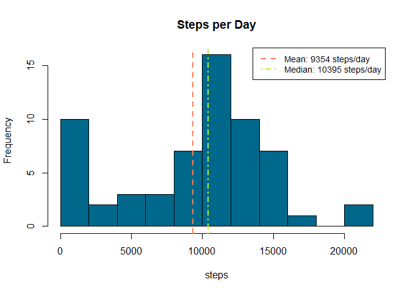
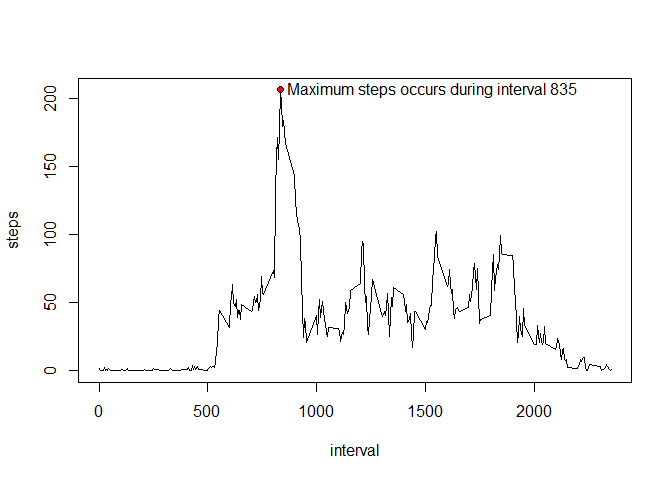
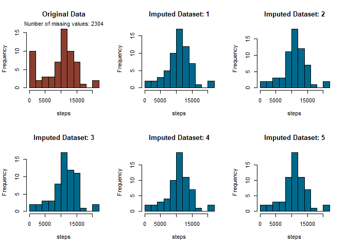
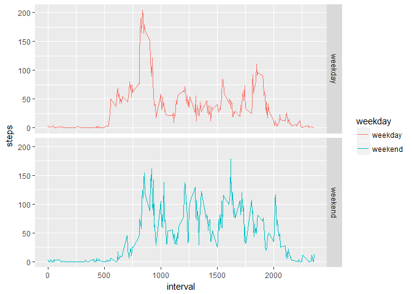
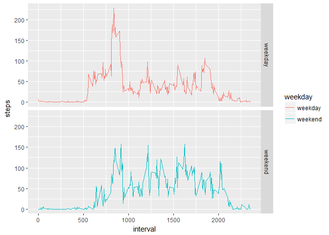
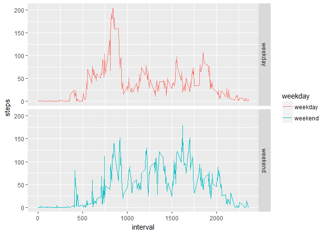
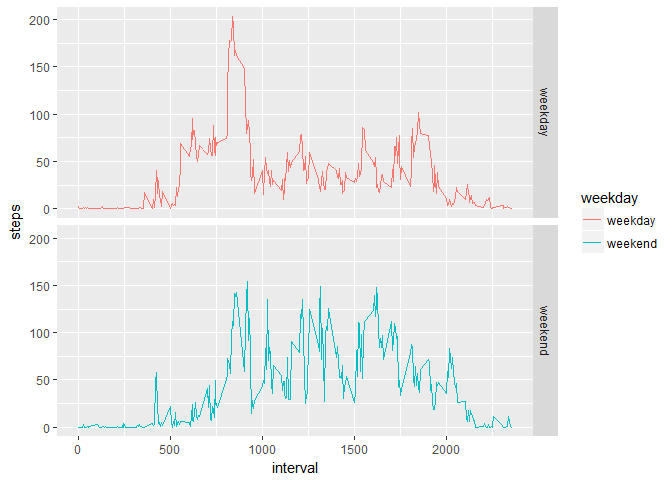
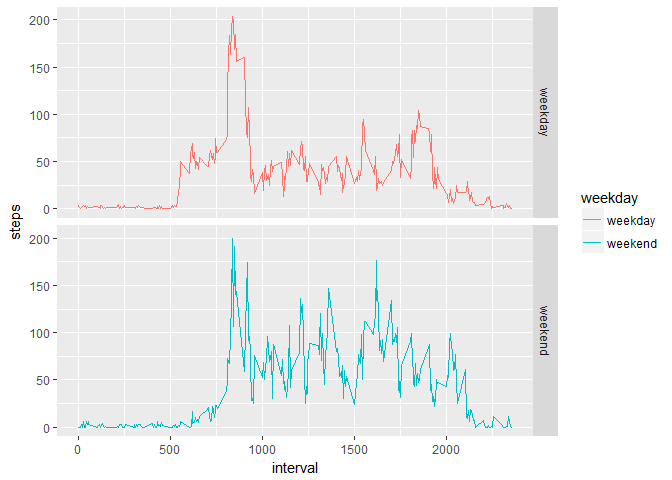

<!--- Set up working directory -->


## Loading and preprocessing the data

```r
# load libraries
suppressMessages(library(ggplot2))
suppressMessages(library(lubridate))
suppressMessages(library(mice))
```

```
## Warning: package 'mice' was built under R version 3.4.3
```

```r
# Unzip File
unzip("activity.zip")

# Read data
data<-read.csv("activity.csv",stringsAsFactors=FALSE)

# convert date to correct data type
data$date<-as.Date(data$date)
```

## What is mean total number of steps taken per day?


```r
# Calculate steps per day
TotPerDay<-aggregate(data$steps,by=list(data$date),FUN=sum,na.rm=TRUE)
colnames(TotPerDay)<-c("date","steps")

# calculate mean and median of steps per day
MeanStep<-mean(TotPerDay$steps,na.rm=TRUE)
MedianStep<-median(TotPerDay$steps,na.rm=TRUE)
```

As can be seen from the figure below the mean total number of steps per day is 9354 steps, while the median total number of steps per day is 10395 steps.


```r
# Create Histogram plot
with(TotPerDay,hist(steps,main="Steps per Day",col="deepskyblue4",breaks=10))

# Add text and lines describing the mean and median
abline(v=MeanStep,col="coral",lty="dashed",lwd=2)
abline(v=MedianStep,col="olivedrab2",lty="dotdash",lwd=2)

# Create Legend fpr mean and median steps per day
legend(x="topright", 
       col = c("coral","olivedrab2"), 
       lty= c("dashed","dotdash"), 
       lwd=2:2,
       legend=c(
           paste0("Mean: ", round(MeanStep), " steps/day"),
           paste0("Median: ", round(MedianStep), " steps/day")),
       cex=0.9)
```

<!-- -->


## What is the average daily activity pattern?


```r
# Calculate mean number of steps per interval for the dataset
ActivityPattern<-aggregate(
    data$steps,
    by=list(data$interval),
    FUN=mean,na.rm=TRUE)
colnames(ActivityPattern)<-c("interval","steps")

#find the interval with the highest number of steps and print this on the chart
maxInterval<-ActivityPattern[which.max(ActivityPattern$steps),]
```

The 5-minute interval that has on average the maximum number of steps is interval 835, with an average number of steps of 206.


```r
# Plot line time series of average steps
with(ActivityPattern,
     plot(interval,steps,type="l")
     )

# print the interval with the highest number of steps on the chart                
with(maxInterval, 
     points(interval,steps,pch=21,bg="red",main="Average Profile of Activity")
     )
text(x=maxInterval$interval+700,
     y=maxInterval$steps,
     labels=paste0("Maximum steps occurs during interval ",maxInterval$interval)
     )
```

<!-- -->

## Imputing missing values


```r
# Calculate and report the total number of missing values in the dataset 
# (i.e. the total number of rows with NAs)
NumberOfMissing<-sum(is.na(data$steps))
```

The total number of missing values in the dataset is 2304.

Predivtive mean matching is applied through the mice package to fill all of the missing values in the dataset. 

In order for the mice package to perform correctly the date column is temporarily converted to integer format to enable mice to identify the sequence of time.

Five imputations are performed to see the level of stability in the produced missing value estimation.


```r
# convert date class to integer for imputation as the mice package
# cannot handle date variables
data$date<-as.integer(data$date)

# # fill in missing values by Predictive mean matching, 
# (create 5 datasets to check stability of estimations)
imputed_Data <- mice(data, m=5, maxit = 100, method = 'pmm', seed = 500,printFlag=FALSE)

# Create a new dataset with the missing data filled in.
completeData <- lapply(1:5,function(i)complete(imputed_Data,i))

# convert date back to correct class
data$date<-as.Date(data$date,origin=as.Date('1970-01-01'))
for(i in 1:5){
    completeData[[i]]$date<-as.Date(completeData[[i]]$date,origin=as.Date('1970-01-01'))
    }

# Calculate daily averages of imputed data for comparison with the original data
TotPerDayImputed<-lapply(1:5,function(i){
    TotPerDay<-aggregate(completeData[[i]]$steps,by=list(completeData[[i]]$date),FUN=sum)
    colnames(TotPerDay)<-c("date","steps")
    return(TotPerDay)
    })

# calculate mean and median of steps per day
MeanStepImpute<-sapply(1:5,function(i)mean(TotPerDayImputed[[i]]$steps,na.rm=TRUE))
MedianStepImpute<-sapply(1:5,function(i)median(TotPerDayImputed[[i]]$steps,na.rm=TRUE))
```

Days with low total steps decrease significantly after missing values have been replace through imputation. The mean total number of steps per day is increased from 9354 to between 10573 and 11113, whereas the median is increased from 10395 to between 10571 and 11162 depending on imputation.
This is expected as days with missing values should have a lower total count compared to days with complete data.

The distribution of total steps per day differ between the imputed data sets, however all of them have a distribution closer to normal compared to the original dataset which had large proportion of days in the region of less than 2500 steps/day.


```r
# plot histogram of the original data
par(mfrow=c(2,3))
with(TotPerDay,hist(steps,main="Original Data",col="coral4",breaks=10))
mtext(paste0("Number of missing values: ",NumberOfMissing),cex=0.7)

# for each of the created inputed datasete, plot these on a common graph to see 
# how they differ
for(i in 1:5){
# Plot line time series of average steps
with(TotPerDayImputed,
# Create Histogram plot
    with(TotPerDayImputed[[i]],hist(steps,main=paste0("Imputed Dataset: ",i),col="deepskyblue4",breaks=10))
)
}
```

<!-- -->

```r
# reset plotting frame
par(mfrow=c(1,1))
```

## Are there differences in activity patterns between weekdays and weekends?


```r
# Create a new factor variable in the dataset with two levels -- "weekday" and 
# "weekend" indicating whether a given date is a weekday or weekend day.
WDayData<-lapply(1:5,function(i){
                    data<-data.frame(
                        completeData[[i]],
                        weekday=as.factor(
                                x=as.numeric(wday(completeData[[i]]$date)%in%c(7,1))
                            )
                    )
                    # Change levels of weekday factor to be more descriptive
                    levels(data$weekday)=c("weekday","weekend")
                    return(data)
                }
            )

# Make a panel time series plot of the average number of steps taken per time 
# inteval, averaged across all weekday days or weekend days 

# Calculate mean number of steps per interval for the dataset
PatternWeekday<-lapply(1:5,function(i){
        data<-aggregate(
            WDayData[[i]]$steps,
            by=list(WDayData[[i]]$interval,WDayData[[i]]$weekday),
            FUN=mean,na.rm=TRUE
            )
        colnames(data)<-c("interval","weekday","steps")
        return(data)
        }
    )
```

Weekdays see a more pronounced peak in steps taken during the morning. This is most likely due to people walking to work.

On the other hand the activity pattern during weekends seems to be more evenly distributed, and the subjects seem to be active slightly later in the evening.  

The difference in demand pattern between diffrent imputation is more pronounced during weekends as these constitute fewer days and hence the proportion of NAs replaced are larger compared to the total number of intervals.


```r
# Plot line time series of average steps
for(i in 1:5){
    print(
        ggplot(PatternWeekday[[i]],aes(x=interval,y=steps,col=weekday))+
        geom_line()+ facet_grid( weekday ~ .)
        )
}
```

<!-- --><!-- --><!-- --><!-- --><!-- -->
 
 
 
